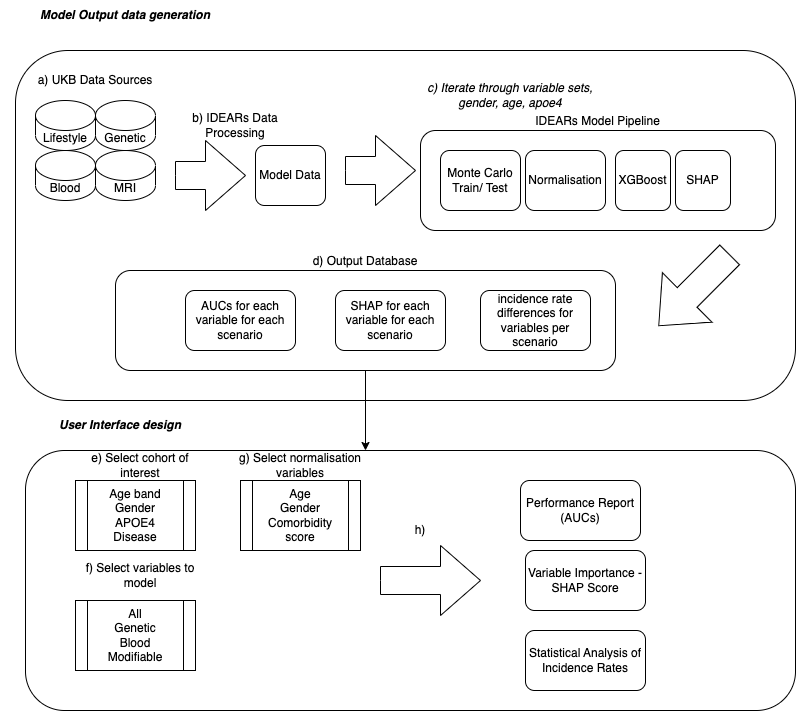
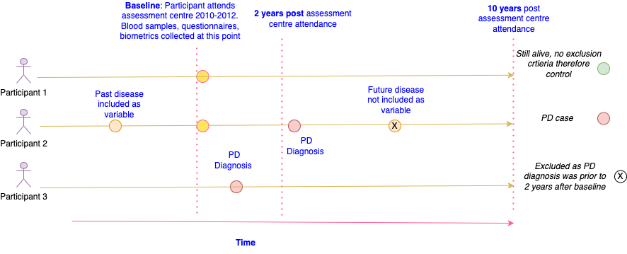

# IDEARS - Integrated Disease Explanation and Associations Risk Scoring

## Overview

This is the codebase for IDEARs - The Integrated Disease Explanation and Associations Risk Scoring. Its overall architecture is shown below:





The code is designed to represent the following situation for prospective studies, which depicts a participant in UKB attending the centre at baseline and then subsequently having a number of outcomes occur




## How to Run
To ease the configuation, please install Anaconda and set this up in a virtual environment. 

1. Install Anaconda:

https://www.anaconda.com/products/individual


## Codebase Structure

### Overview
Import modules etc.

### Directory Tree and Explanations

This folder shows the implementation of the IDEARs platform.

```
📦ukb_IDEARS-pipeline-poc
 ┣ 
 ┃ ┣ src
 ┃ ┃ ┣ idears
 ┃ ┃ ┃ ┣ 📂 preprocessing        
 ┃ ┃ ┃ ┃  ┣  📜 data_proc.py
 ┃ ┃ ┃ ┃  ┣  📜 idears_backend.py 
 ┃ ┃ ┃ ┃ 📂 models
 ┃ ┃ ┃ ┃  ┣  📜 mlv2.py       
 ┃ ┃ ┃ ┃ 📂 frontend
 ┃ ┃ ┃ ┣ ┣ 📜 app1.py
 ┃ ┣ applications
 ┃ ┃ ┃-AD
 ┃ ┃ ┃-PD
 ┣ 📜config.yaml
 ┣ 📜requirements.txt
 ┣ 📜main.py
 ┣ 📜README.md
 ┣
```


## The Roadmap

We are building a web app which enables specific combinations of variables to be modelled, specific ICD10s to be selected to model, normalisations to be performed and a host of visualisations to be produced as output

## Enquiries

Michael Allwright - michael@allwrightanalytics.com

